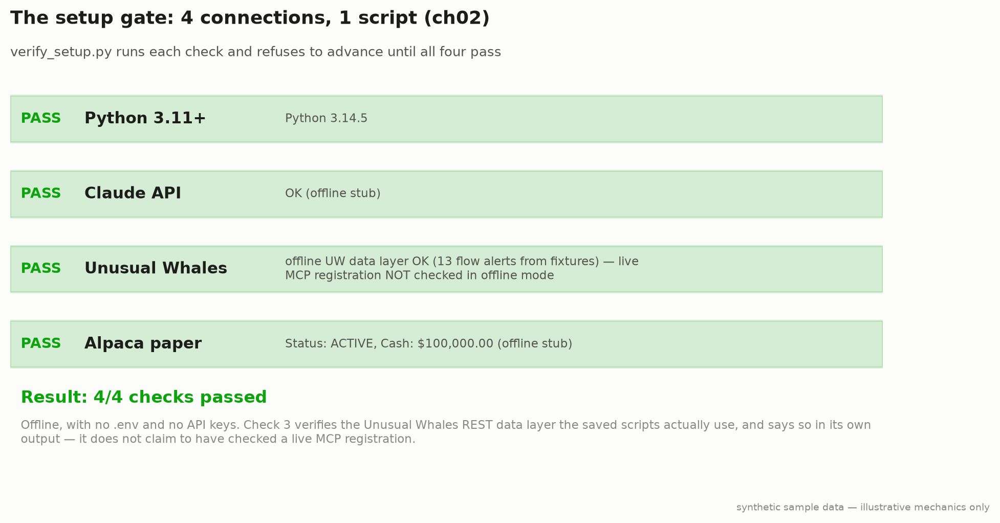

# 1. Setup: the 4/4 gate (Chapter 2)



*Computed by `setup/verify_setup.py` against the bundled synthetic fixtures (regenerate with `python tools/generate_docs_charts.py`).*

## What it is

Four connections, one script. Chapter 2 refuses to let you into Chapter 3 until
all four report PASS, and that gate is the highest-value thing in the
chapter: most people who want an AI trading bot never get past setup, because the
tutorials they follow are broken, the APIs have changed, or the instructions assume
knowledge they don't have.

| Piece | Role | What it costs |
|---|---|---|
| **Python 3.11+** | where the bot lives | $0 |
| **Claude API** | the brain | $5 starter credit, then per-token |
| **Unusual Whales** | the eyes | **$50/week Trial minimum** |
| **Alpaca** | the hands | $0, $100K virtual |

## How to run it

```bash
python setup/verify_setup.py     # -> Result: 4/4 checks passed
python setup/test_claude.py
python setup/test_alpaca.py      # -> Account status: ACTIVE / Cash: $100,000.00
```

Offline (the default) all four checks pass with **no `.env` and no keys at all**.

## What check 3 actually checks, and what it doesn't

This is the one place the repo's offline mode cannot honestly reproduce the book,
so it says so out loud rather than faking a pass.

* **Live** (`CTB_OFFLINE=0`): shells out to `claude mcp list` and looks for the
  `unusualwhales` server, exactly as ch02 prints. `claude mcp list` is the source
  of truth (ch02.md:201-204).
* **Offline**: there is no Claude Code session to interrogate, so it verifies the
  thing the *saved scripts* actually depend on: that the Unusual Whales REST data
  layer answers a flow-alerts request through the same code path `screener.py`
  uses. **The printed label names exactly what was checked.**

A rationalized PASS would be worse than an honest one.

## Registering the UW MCP (the real thing)

```bash
claude mcp add --transport http unusualwhales \
  https://api.unusualwhales.com/api/mcp \
  --header "Authorization: Bearer $UW_API_KEY"

claude mcp list          # the source of truth
```

Bearer token in the **`Authorization` header**, not a query parameter.

> There is **no `mcp_config.json`** in this repo, and there should be none in your
> project either. The `pip install unusual-whales-mcp` + config-file pattern in
> some community write-ups uses a **community fork**, not the official server.
> Claude Code keeps MCP registrations in its own config layer. (ch02.md:353)

## Failure modes the book names

| Symptom | Cause | Fix |
|---|---|---|
| `ModuleNotFoundError: No module named 'anthropic'` | you're outside the venv | `source venv/bin/activate` |
| `AuthenticationError` from Claude | wrong key, usually a trailing space | re-paste from console.anthropic.com |
| No MCP tools available | `unusualwhales` isn't registered | re-run `claude mcp add`, then `claude mcp list` |
| `401` from UW | wrong or expired key | re-copy from UW account settings |
| `403` from UW | **wrong tier** | Free Shamu has no API. Trial $50/wk is the floor. |
| `Forbidden` from Alpaca | paper vs live keys mixed | they are different pairs. Don't mix them. |
| `SSL Certificate Error` on Windows | missing certs | `pip install certifi` |
| `No module named 'alpaca'` | you installed `alpaca`, not `alpaca-py` | `pip uninstall alpaca && pip install alpaca-py` |

Full table: [troubleshooting.md](troubleshooting.md).

## The prompts

* [`prompts/01_mcp_connection_test.md`](../prompts/01_mcp_connection_test.md)
* [`prompts/02_combined_stack_test.md`](../prompts/02_combined_stack_test.md)

---

*Illustrative results on synthetic sample data. Not indicative of real or historical performance. Educational software. Not financial advice. See [DISCLAIMER.md](../DISCLAIMER.md).*
