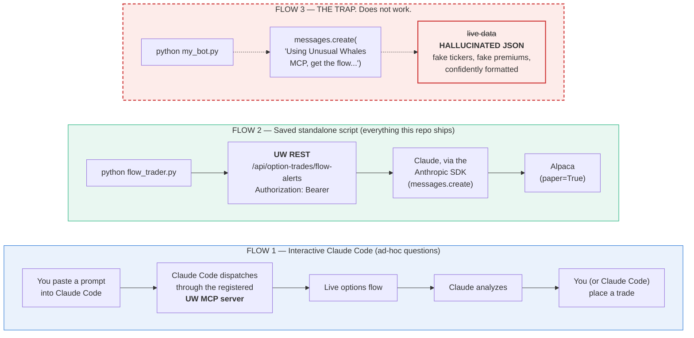
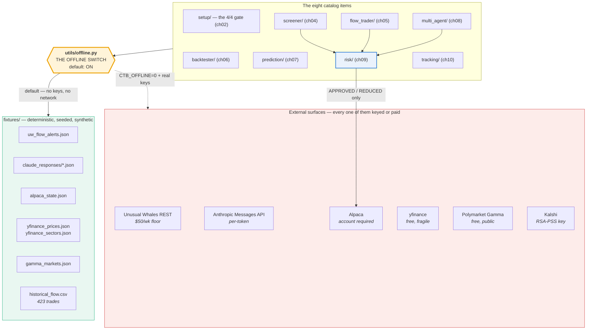
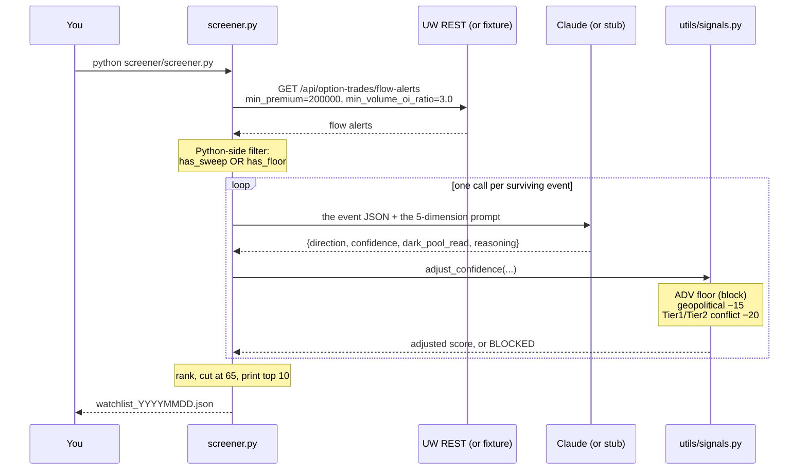

# Architecture

## The one thing the book repeats more than any other: **two flows, not one**

There are exactly two ways to get live market data into Claude in this book, and
they are not interchangeable. There is also a **third pattern that looks like it
works and doesn't**: it returns confident, well-formatted, completely invented
JSON, which is the worst possible failure mode for a trading bot.

If you internalize nothing else from this page, internalize the struck-through
lane.



**Why Flow 3 fails:** the vanilla Anthropic Messages API has **no MCP connection**.
MCP is dispatched by the *client* (Claude Code), not by the model. A saved script
calling `messages.create()` with a prompt that says "Using Unusual Whales MCP…"
gets a model with no tool to call. Ask it for JSON it can't fetch, and it invents
JSON instead. It will look right. It will be wrong.

**Every saved script in this repo uses Flow 2**, deliberately, which is why they
all run standalone.

> There is deliberately **no `mcp_config.json`** anywhere in this repository.
> The `pip install unusual-whales-mcp` + config-file pattern you'll find in some
> community write-ups is not how the official UW MCP works. That PyPI package is
> a **community fork**. The official server is Node-based, runs via `npx`, and is
> registered with Claude Code through `claude mcp add`. `claude mcp list` is the
> source of truth. (ch02.md:353)

---

## What this repo actually is



**Every artifact in this book touches a keyed or paid surface.** That is not a
criticism of the book. It is honest about the $50/week Unusual Whales floor from
page one. But it means a companion repo that only runs when you hold all four
credentials would be useless to almost everyone who buys it.

So the default is inverted: **offline is on unless you turn it off.** Each stub
answers the exact request/response schema the book's code expects, so the code
paths that run against fixtures are the same code paths that run against the live
APIs.

---

## The risk module is a gatekeeper, not a bot

Notice where `risk/` sits in the diagram above. It is not a strategy. It is the
thing that stands between **every** bot's decision and Alpaca's order API
(ch09.md:423). The screener, the flow trader and the multi-agent system all route
through it, and it can say no to any of them.

It makes **no Claude calls at all**. Every check is math or public data:

| Rule | Source of truth |
|---|---|
| Position sizing (quarter-Kelly, 2% cap, zero floor) | arithmetic |
| Daily loss limit | Alpaca account value |
| Stop-loss at entry | arithmetic |
| Sector concentration | `yfinance.Ticker(s).info['sector']` |
| Earnings blackout | `yf.Ticker(s).calendar` |

Asking Claude "what sector is NVDA in?" costs real money on every multi-agent
cycle for an answer yfinance gives free. Asking Claude "does NVDA have earnings in
three days?" is worse: the vanilla Messages API has **no live earnings calendar**,
so it either refuses or guesses from training data that is months stale by
publication.

---

## Two protective-stop mechanisms, and they are not the same

| | ch05 `flow_trader` | ch08 `multi_agent` |
|---|---|---|
| Mechanism | **soft stop in code** | **Alpaca bracket order** |
| Lives where | in your Python loop | at the broker |
| Fires when the bot is offline? | **No** | **Yes** |
| Fires when your API connection drops? | **No** | **Yes** |

ch05 is explicit about this: its stop is "a *soft stop in code*, not a hard stop
order placed with the broker" (ch05.md:491). If the bot is not running, nothing
fires.

ch08's Executor submits a single `MarketOrderRequest` with
`order_class=OrderClass.BRACKET`, and Alpaca creates the parent, the take-profit
child and the stop-loss child on fill. The protective legs are with the broker from
the moment the trade opens.

ch11 recommends bracket orders as the fix for the "API goes down during a crash"
failure mode, and mis-cites them to "Chapter 9". **They are ch08's.** (See
[book-deviations.md #15](book-deviations.md#15).)

---

## Data flow through one screener run



The `utils/signals.py` step is this repo's addition. Chapter 3 states three rules
its bots run; **no code the book prints implements any of them.** See
[book-deviations.md #14](book-deviations.md#14).

---

## Repository layout

```
claude-trading-bot/
├── setup/          ch02   the 4/4 gate before you build anything
├── screener/       ch04   scan the flow, rank a watchlist
├── flow_trader/    ch05   poll, analyze, decide, execute
├── backtester/     ch06   Monte Carlo + overfit check. NO LLM, by design.
├── prediction/     ch07   Polymarket/Kalshi analyzer. READ-ONLY, forever.
├── multi_agent/    ch08   Monitor → Analyst → Risk → Executor
├── risk/           ch09   five hard rules. The gatekeeper.
├── tracking/       ch10   the 90-day go-live ladder
├── utils/
│   ├── offline.py         THE OFFLINE SWITCH + every deterministic stub
│   └── signals.py         ch03's analysis contract, as code
├── prompts/        the 12 verbatim PASTE TO CLAUDE CODE blocks
├── templates/      Appendix B — 5 strategy templates + the cheat sheet
├── fixtures/       deterministic, seeded, synthetic. Zero keys.
├── examples/       one runnable offline demo per catalog item
├── tests/          every CHECKPOINT in the book, as an assertion
├── tools/          generate_docs_charts.py · demo.py
└── docs/           you are here
```

`ai-trading-bot/` (the tree ch02 has you build) is **your own local project
directory**, not this repo. This repo is the reference implementation you compare
against.

---

*Educational software. Not financial advice. See [DISCLAIMER.md](../DISCLAIMER.md).*
